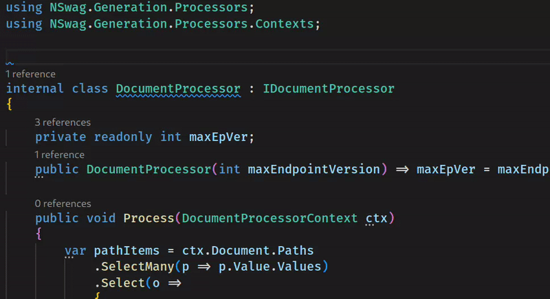
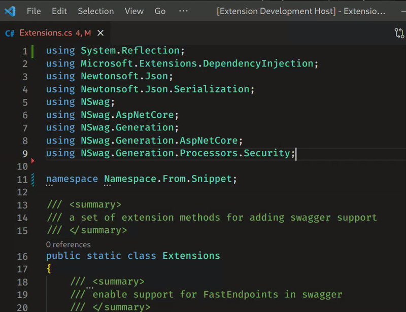
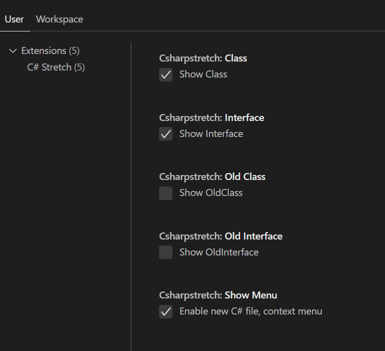

# C# Stretch

Simple VSCode extension to improve and stretch c# experience


## Features

### Create New Class

You can create a class from the context menu with modern C# syntax and namespace.


```csharp
namespace TestMake.Features.PDF;

public class NewClass
{
    
}
```

### Create Interface

```csharp
namespace TestMake.Features.PDF;

public interface NewInterface
{
    
}
```

### Create Old Class

```csharp
namespace TestMake.Features.PDF
{
    public class OldClass
    {
        
    }
}
```

### Create Old Interface

```csharp
namespace TestMake.Features.PDF
{
    public interface OldInterface
    {
        
    }
}
```

### Namespace

The namespace can be derived from folder path.
Additionally the root namespace can also be specified in the .csproj file.

```xml
<RootNamespace>TestMake</RootNamespace>
```

### Fill Namespace



### Fix Namespace



### Settings



- Can disable context menu completely.
- Can toggle context menu options on and off

## Why This Extension

- Lightweight and super simple
- No external dependencies
- Private (No Data collection or telemetry)
- Modern C# syntax (As well as option to enable old namespace syntax)
- Context menu to create C# files only visible after C# language activation (This drove me to create this extension)
- Context menu settings to show and hide items

## Special Thanks

Greatly inspired and using code from:

[C# Namespace Autocompletion](https://github.com/AdrianWilczynski/NamespaceAutocompletion)

[C# Extensions](https://github.com/kreativjos/csharpextensions)

[C# Helper](https://github.com/sharklasers996/csharp-helper)
